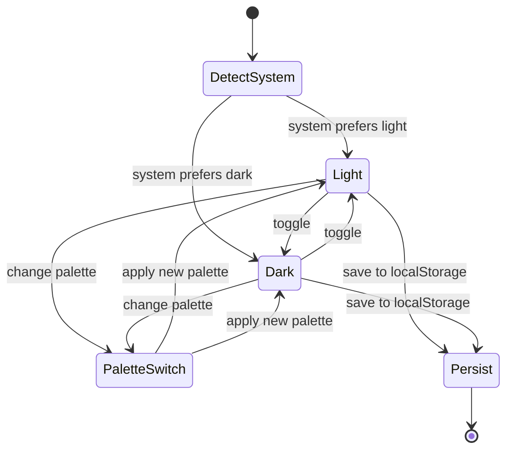
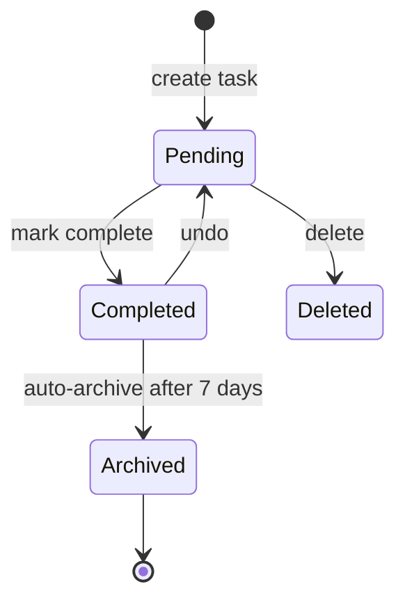
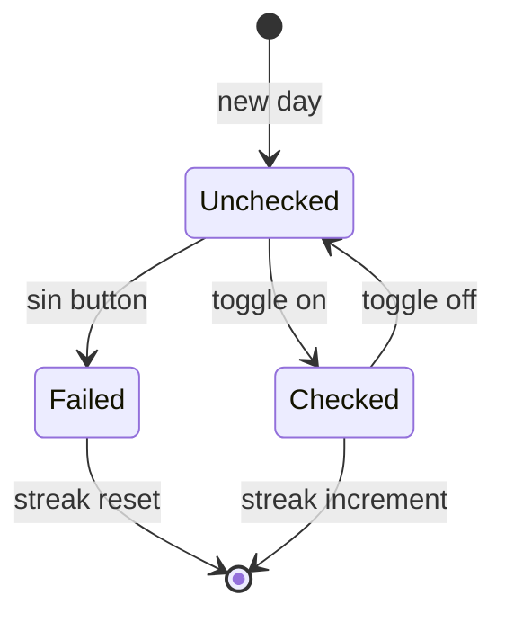
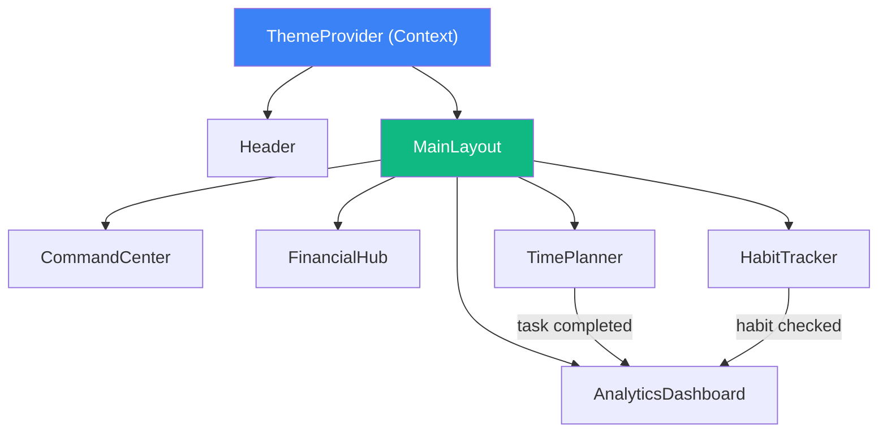

# LifeOS — Component Specification

> **Version:** 1.0  
> **Last Updated:** 2026-07-17  
> **Author:** Lead Engineer  
> **Status:** Draft — Pending Review  
> **Depends on:** UX_SPEC.md, DESIGN_SYSTEM.md, MOTION_SPEC.md, DATA_SCHEMA.md

---

## 1. Component Hierarchy

```
App
├── Layout
│   ├── Header (Topbar)
│   └── MainContent (Bento Grid)
│       ├── CommandCenter
│       ├── FinancialHub
│       ├── HabitTracker
│       ├── TimePlanner
│       └── AnalyticsDashboard
│
├── Common (Reusable)
│   ├── Card
│   ├── MetricCard
│   ├── ProgressBar
│   ├── AnimatedCounter
│   ├── SectionTitle
│   ├── IconButton
│   ├── Badge
│   ├── Skeleton
│   ├── EmptyState
│   └── ErrorState
│
└── Providers
    └── ThemeProvider
```

---

## 2. Common Components

### 2.1 Card

**Purpose:** Base container for all dashboard modules and metric displays.

| Prop | Type | Required | Default | Description |
|------|------|----------|---------|-------------|
| `title` | string | ✅ | — | Card header text |
| `subtitle` | string | ❌ | `undefined` | Context text below title |
| `icon` | ReactNode | ❌ | `undefined` | Icon displayed next to title |
| `children` | ReactNode | ✅ | — | Card body content |
| `footer` | ReactNode | ❌ | `undefined` | Footer section |
| `loading` | boolean | ❌ | `false` | Show skeleton state |
| `error` | string \| null | ❌ | `null` | Error message to display |
| `empty` | boolean | ❌ | `false` | Show empty state |
| `emptyMessage` | string | ❌ | `"No data"` | Empty state message |
| `className` | string | ❌ | `""` | Additional CSS classes |
| `span` | `6 \| 12` | ❌ | `6` | Grid column span |

**States:**

| State | Visual |
|-------|--------|
| Default | Flat surface, 1px border, content visible |
| Hover | translateY(-2px), shadow-md |
| Loading | Skeleton pulse, matching content layout |
| Empty | Centered illustration + emptyMessage |
| Error | Error icon + error message + retry button |

**Accessibility:**
- `role="region"` with `aria-label={title}`
- Loading: `aria-busy="true"`

---

### 2.2 MetricCard

**Purpose:** Display a single key metric with label, value, and optional delta/trend.

| Prop | Type | Required | Default | Description |
|------|------|----------|---------|-------------|
| `title` | string | ✅ | — | Metric label |
| `value` | number \| string | ✅ | — | Current value |
| `prefix` | string | ❌ | `""` | e.g., "$", "₫" |
| `suffix` | string | ❌ | `""` | e.g., "%", "days" |
| `delta` | number | ❌ | `undefined` | Change from previous period |
| `deltaLabel` | string | ❌ | `"vs last period"` | Delta context |
| `trend` | `"up" \| "down" \| "neutral"` | ❌ | `"neutral"` | Trend direction |
| `icon` | ReactNode | ❌ | `undefined` | Metric icon |
| `loading` | boolean | ❌ | `false` | Skeleton state |
| `animated` | boolean | ❌ | `true` | Animate count-up on mount |
| `className` | string | ❌ | `""` | Additional classes |

**States:**

| State | Visual |
|-------|--------|
| Default | Large value, small label, delta with color |
| Loading | Skeleton: value placeholder (wider), label placeholder (shorter) |
| Animated | Count from 0 to value on mount |

**Delta colors:**
- `trend="up"`: Green text + ↑ arrow (for positive metrics like income)
- `trend="down"`: Red text + ↓ arrow (for negative metrics)
- `trend="neutral"`: Gray text + → arrow

---

### 2.3 ProgressBar

**Purpose:** Horizontal bar showing progress toward a goal.

| Prop | Type | Required | Default | Description |
|------|------|----------|---------|-------------|
| `value` | number | ✅ | — | Current value |
| `max` | number | ✅ | — | Maximum/goal value |
| `color` | string | ❌ | `"--color-primary"` | Bar fill color |
| `backgroundColor` | string | ❌ | `"--color-border"` | Track color |
| `height` | number | ❌ | `8` | Bar height in px |
| `animated` | boolean | ❌ | `true` | Animate fill on mount |
| `showLabel` | boolean | ❌ | `false` | Show percentage text |
| `label` | string | ❌ | `""` | Custom label text |
| `className` | string | ❌ | `""` | Additional classes |

**States:**

| State | Visual |
|-------|--------|
| Default | Filled bar at percentage |
| Animated | Bar grows from 0% to target, 600ms easeOutExpo |
| Full (100%) | Full bar + optional celebration micro-animation |
| Empty (0%) | Track only, no fill |

**Accessibility:**
- `role="progressbar"`
- `aria-valuenow={value}`
- `aria-valuemin={0}`
- `aria-valuemax={max}`
- `aria-label={label || title}`

---

### 2.4 AnimatedCounter

**Purpose:** Display a number that counts up from 0 to target on mount.

| Prop | Type | Required | Default | Description |
|------|------|----------|---------|-------------|
| `value` | number | ✅ | — | Target number |
| `duration` | number | ❌ | `800` | Animation duration in ms |
| `prefix` | string | ❌ | `""` | Text before number |
| `suffix` | string | ❌ | `""` | Text after number |
| `decimals` | number | ❌ | `0` | Decimal places |
| `easing` | string | ❌ | `"easeOutExpo"` | Easing function |
| `className` | string | ❌ | `""` | Additional classes |

**Accessibility:**
- `aria-live="polite"` to announce final value
- Reduced motion: show final value immediately

---

### 2.5 SectionTitle

**Purpose:** Consistent heading for card sections.

| Prop | Type | Required | Default | Description |
|------|------|----------|---------|-------------|
| `title` | string | ✅ | — | Section heading |
| `subtitle` | string | ❌ | `undefined` | Supporting text |
| `icon` | ReactNode | ❌ | `undefined` | Leading icon |
| `action` | ReactNode | ❌ | `undefined` | Right-aligned action (button/link) |
| `size` | `"sm" \| "md" \| "lg"` | ❌ | `"md"` | Typography size |

---

### 2.6 IconButton

**Purpose:** Icon-only button with tooltip.

| Prop | Type | Required | Default | Description |
|------|------|----------|---------|-------------|
| `icon` | ReactNode | ✅ | — | Lucide icon |
| `label` | string | ✅ | — | Accessible label + tooltip text |
| `onClick` | function | ✅ | — | Click handler |
| `variant` | `"ghost" \| "outline" \| "solid"` | ❌ | `"ghost"` | Visual style |
| `size` | `"sm" \| "md" \| "lg"` | ❌ | `"md"` | Button size |
| `disabled` | boolean | ❌ | `false` | Disabled state |
| `className` | string | ❌ | `""` | Additional classes |

**Accessibility:**
- `aria-label={label}`
- Show tooltip on hover/focus

---

### 2.7 Badge

**Purpose:** Small status label.

| Prop | Type | Required | Default | Description |
|------|------|----------|---------|-------------|
| `text` | string | ✅ | — | Badge text |
| `variant` | `"default" \| "success" \| "warning" \| "danger" \| "info"` | ❌ | `"default"` | Color scheme |
| `size` | `"sm" \| "md"` | ❌ | `"sm"` | Size |
| `dot` | boolean | ❌ | `false` | Show colored dot prefix |

---

### 2.8 Skeleton

**Purpose:** Loading placeholder matching content layout.

| Prop | Type | Required | Default | Description |
|------|------|----------|---------|-------------|
| `width` | string \| number | ❌ | `"100%"` | Skeleton width |
| `height` | string \| number | ❌ | `20` | Skeleton height in px |
| `rounded` | boolean | ❌ | `false` | Circular skeleton |
| `lines` | number | ❌ | `1` | Number of text line skeletons |
| `className` | string | ❌ | `""` | Additional classes |

---

### 2.9 EmptyState

**Purpose:** Placeholder when a module has no data.

| Prop | Type | Required | Default | Description |
|------|------|----------|---------|-------------|
| `message` | string | ✅ | — | Primary message |
| `description` | string | ❌ | `undefined` | Supporting text |
| `icon` | ReactNode | ❌ | `undefined` | Illustration/icon |
| `action` | ReactNode | ❌ | `undefined` | CTA button |

---

### 2.10 ErrorState

**Purpose:** Error display with retry option.

| Prop | Type | Required | Default | Description |
|------|------|----------|---------|-------------|
| `message` | string | ✅ | — | Error message |
| `onRetry` | function | ❌ | `undefined` | Retry callback |
| `icon` | ReactNode | ❌ | AlertCircle | Error icon |

---

## 3. Layout Components

### 3.1 Header (Topbar)

**Purpose:** Top navigation bar with logo, nav links, and actions.

| Prop | Type | Required | Default | Description |
|------|------|----------|---------|-------------|
| `activeSection` | string | ✅ | — | Currently active nav section |
| `onNavigate` | function | ✅ | — | Navigation callback `(section: string) => void` |
| `onThemeChange` | function | ✅ | — | Theme switch callback |
| `currentTheme` | string | ✅ | — | Current theme identifier |

**Internal state:**
- `mobileMenuOpen: boolean` — controls mobile hamburger overlay

**Nav items (hardcoded):**

| Key | Label | Icon |
|-----|-------|------|
| `dashboard` | Dashboard | LayoutDashboard |
| `financial` | Financial | Wallet |
| `habits` | Habits | Target |
| `planner` | Planner | CalendarDays |
| `analytics` | Analytics | BarChart3 |

**States:**

| State | Visual |
|-------|--------|
| Default | Horizontal nav, all links visible |
| Scrolled | Sticky, subtle bottom shadow |
| Mobile | Hamburger icon → overlay menu |

---

### 3.2 MainLayout

**Purpose:** Wraps Topbar + Bento Grid content area.

| Prop | Type | Required | Default | Description |
|------|------|----------|---------|-------------|
| `children` | ReactNode | ✅ | — | Dashboard module cards |

**Responsibilities:**
- Apply container max-width (1440px)
- Apply CSS Grid (12-col) with responsive gap
- Handle scroll-spy for active section detection

---

## 4. Dashboard Module Components

### 4.1 CommandCenter

**Purpose:** Hero module — greeting, time, weather, goal countdown.

| Prop | Type | Required | Default | Description |
|------|------|----------|---------|-------------|
| `user` | UserData | ✅ | — | User name for greeting |
| `weather` | WeatherData | ✅ | — | Weather display data |
| `goal` | GoalData | ✅ | — | Primary goal with deadline |

**Internal state:**
- `currentTime: Date` — updated every second
- `greeting: string` — computed from hour (Morning/Afternoon/Evening)

**Sub-sections:**

| Section | Content | Animation |
|---------|---------|-----------|
| Greeting | "Good morning, {name}" | Entrance fade-in |
| Clock | HH:MM:SS, realtime | Number tick |
| Weather | City, temp°C, condition icon | Entrance fade-in |
| Countdown | Days/Hours/Minutes to goal deadline | Number count-up |

**Grid span:** 12 (full width)

---

### 4.2 FinancialHub

**Purpose:** Financial health overview — income, expense, savings, heatmap.

| Prop | Type | Required | Default | Description |
|------|------|----------|---------|-------------|
| `data` | FinancialData | ✅ | — | All financial data |
| `loading` | boolean | ❌ | `false` | Loading state |

**Sub-sections:**

| Section | Component Used | Data |
|---------|---------------|------|
| Income | MetricCard | `data.income`, trend |
| Expense | MetricCard | `data.expense`, trend |
| Balance | MetricCard | `data.income - data.expense` |
| Savings Rate | MetricCard | `data.saving / data.income * 100` |
| Expense Heatmap | Custom (365-cell grid) | `data.heatmap[365]` |
| Emergency Fund | ProgressBar | `data.emergencyFund.current / target` |

**Heatmap interaction:**
- Hover cell → tooltip: date + amount
- Color intensity: linear mapping from min to max expense

**Grid span:** 6

---

### 4.3 HabitTracker

**Purpose:** Daily habit tracking with weekly view and streak system.

| Prop | Type | Required | Default | Description |
|------|------|----------|---------|-------------|
| `habits` | Habit[] | ✅ | — | List of habits |
| `onToggle` | function | ✅ | — | `(habitId: string, day: number) => void` |
| `onSin` | function | ✅ | — | `(habitId: string) => void` |
| `loading` | boolean | ❌ | `false` | Loading state |

**Sub-sections:**

| Section | Content | Interaction |
|---------|---------|-------------|
| Weekly table | 7 columns (Mon–Sun), rows per habit | Click cell → toggle check |
| Streak counter | Per-habit streak number | AnimatedCounter on mount |
| Completion rate | Overall % for the week | ProgressBar |
| Sin/Fail button | Per-habit destructive action | Click → shake animation + log |

**Sin button behavior:**
1. Click → confirmation (prevent accidental tap)
2. Confirmed → shake animation (MOTION_SPEC 8.2)
3. Streak resets to 0
4. Log entry created

**Grid span:** 6

---

### 4.4 TimePlanner

**Purpose:** Task management with day/week/month views.

| Prop | Type | Required | Default | Description |
|------|------|----------|---------|-------------|
| `tasks` | Task[] | ✅ | — | All tasks |
| `activeView` | `"day" \| "week" \| "month"` | ❌ | `"day"` | Current view |
| `onViewChange` | function | ✅ | — | `(view: string) => void` |
| `onAddTask` | function | ✅ | — | `(task: NewTask) => void` |
| `onCompleteTask` | function | ✅ | — | `(taskId: string) => void` |
| `onDeleteTask` | function | ✅ | — | `(taskId: string) => void` |
| `loading` | boolean | ❌ | `false` | Loading state |

**Sub-sections:**

| Section | Content | Interaction |
|---------|---------|-------------|
| View tabs | Day / Week / Month | Click → switch view (tab transition) |
| Task list | Filtered by view, sorted by priority | Scroll within card |
| Add task form | Slide-in from bottom | Title, priority, deadline, tags |
| Task item | Title, priority badge, deadline, checkbox | Complete → strikethrough exit |

**Task priority visual:**

| Priority | Badge Color | Sort Order |
|----------|-------------|------------|
| High | `--color-danger` | 1 (top) |
| Medium | `--color-warning` | 2 |
| Low | `--color-info` | 3 (bottom) |

**Grid span:** 6

---

### 4.5 AnalyticsDashboard

**Purpose:** Productivity overview — completion, focus, burnout, weekly trend.

| Prop | Type | Required | Default | Description |
|------|------|----------|---------|-------------|
| `data` | AnalyticsData | ✅ | — | All analytics data |
| `loading` | boolean | ❌ | `false` | Loading state |

**Sub-sections:**

| Section | Component | Data | Animation |
|---------|-----------|------|-----------|
| Completion Rate | SVG circular progress | `data.completionRate` | strokeDashoffset animation |
| Focus Score | MetricCard | `data.focusScore` (0–100) | Number count-up |
| Burnout Risk | MetricCard + visual | `data.burnoutRisk` (0–100) | Color-coded, pulse if > 70 |
| 7-Day Chart | Bar chart (custom SVG/div) | `data.weekly[7]` | Bar growth with stagger |

**Burnout risk color coding:**

| Range | Color | Visual |
|-------|-------|--------|
| 0–30 | Green (`--color-success`) | Normal |
| 31–60 | Yellow (`--color-warning`) | Caution text |
| 61–100 | Red (`--color-danger`) | Pulse animation + recommendation |

**Grid span:** 6

---

## 5. State Diagrams

### 5.1 Theme State



### 5.2 Task State



### 5.3 Habit Check State



---

## 6. Component Communication



**Data flow:**
- ThemeProvider → All components (theme context)
- MainLayout → Module components (layout positioning)
- Task completion in Planner → triggers Analytics recalculation
- Habit check in HabitTracker → triggers Analytics recalculation
