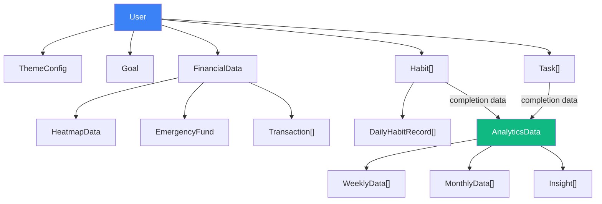

# LifeOS — Data Schema Specification

> **Version:** 1.0  
> **Last Updated:** 2026-07-17  
> **Author:** Lead Engineer  
> **Status:** Draft — Pending Review  
> **Depends on:** PRD.md (module definitions)

---

## 1. Overview

This document defines all data models for LifeOS. Each model is defined as a TypeScript interface for precision, but the schema is **technology-agnostic** — it can be implemented in any language or database.

**MVP data source:** Hardcoded mock data (`mockData.js`)  
**Future data source:** REST API / Backend integration (see Section 8: API Spec)

---

## 2. Core Models

### 2.1 User

```typescript
interface User {
  id: string;                    // UUID
  name: string;                  // Display name
  avatar: string;                // URL or initials
  timezone: string;              // IANA timezone (e.g., "Asia/Ho_Chi_Minh")
  theme: ThemeConfig;            // Current theme preference
  createdAt: string;             // ISO 8601 datetime
}

interface ThemeConfig {
  palette: PaletteId;            // "deep-sea-mint" | "icy-navy" | "vibrant-pop" | "citrus-sunrise"
  mode: "light" | "dark" | "system";
}

type PaletteId = "deep-sea-mint" | "icy-navy" | "vibrant-pop" | "citrus-sunrise";
```

### 2.2 Weather

```typescript
interface WeatherData {
  city: string;                  // e.g., "Hanoi"
  temperature: number;           // Celsius
  condition: WeatherCondition;
  icon: string;                  // Icon identifier
  updatedAt: string;             // ISO 8601
}

type WeatherCondition = "sunny" | "cloudy" | "rainy" | "stormy" | "snowy" | "partly-cloudy";
```

> **MVP Note:** Weather is hardcoded. Future: OpenWeatherMap API integration.

### 2.3 Goal

```typescript
interface Goal {
  id: string;                    // UUID
  title: string;                 // e.g., "Launch MVP"
  deadline: string;              // ISO 8601 date (e.g., "2026-12-31")
  progress: number;              // 0–100 percentage
  milestones: Milestone[];
  createdAt: string;
}

interface Milestone {
  id: string;
  title: string;
  completed: boolean;
  completedAt: string | null;    // ISO 8601 or null
}
```

---

## 3. Financial Models

### 3.1 FinancialData

```typescript
interface FinancialData {
  income: number;                // Total income this month (VND or USD)
  expense: number;               // Total expense this month
  saving: number;                // income - expense
  savingsRate: number;           // saving / income * 100 (percentage)
  goal: number;                  // Monthly savings goal
  currency: string;              // "VND" | "USD"
  
  emergencyFund: EmergencyFund;
  heatmap: HeatmapData;
  transactions: Transaction[];
  
  // Computed / derived
  balance: number;               // income - expense (same as saving for simplicity)
  monthlyBurnRate: number;       // Average daily expense × 30
}

interface EmergencyFund {
  current: number;               // Current fund amount
  target: number;                // Target fund amount (e.g., 6 months expenses)
  percentage: number;            // current / target * 100
}
```

### 3.2 Heatmap

```typescript
interface HeatmapData {
  year: number;                  // e.g., 2026
  cells: HeatmapCell[];          // 365 entries (or 366 for leap year)
}

interface HeatmapCell {
  date: string;                  // ISO 8601 date (YYYY-MM-DD)
  value: number;                 // Expense amount for that day
  level: 0 | 1 | 2 | 3 | 4;    // Intensity level (0 = none, 4 = highest)
}
```

**Level calculation:**
| Level | Range | Color Intensity |
|-------|-------|----------------|
| 0 | 0 (no expense) | Empty / transparent |
| 1 | 1–25th percentile | Lightest accent |
| 2 | 25–50th percentile | Light accent |
| 3 | 50–75th percentile | Medium accent |
| 4 | 75–100th percentile | Darkest accent |

### 3.3 Transaction

```typescript
interface Transaction {
  id: string;                    // UUID
  amount: number;                // Positive = income, Negative = expense
  category: TransactionCategory;
  description: string;
  date: string;                  // ISO 8601 date
  type: "income" | "expense";
}

type TransactionCategory = 
  | "salary" | "freelance" | "investment" | "other-income"    // Income
  | "food" | "transport" | "housing" | "utilities"            // Expense
  | "entertainment" | "shopping" | "health" | "education"     // Expense
  | "subscription" | "other-expense";                         // Expense
```

---

## 4. Habit Models

### 4.1 Habit

```typescript
interface Habit {
  id: string;                    // UUID
  name: string;                  // e.g., "Read 30 mins"
  icon: string;                  // Lucide icon name
  streak: number;                // Current consecutive days
  bestStreak: number;            // All-time best streak
  week: DayStatus[];             // 7 entries for current week (Mon–Sun)
  completionRate: number;        // 0–100, calculated over last 30 days
  history: DailyHabitRecord[];   // Historical data
  createdAt: string;             // ISO 8601
}

type DayStatus = "done" | "missed" | "pending" | "failed";

interface DailyHabitRecord {
  date: string;                  // ISO 8601 date
  status: DayStatus;
  sinNote: string | null;        // Note when failed/sin
}
```

### 4.2 Habit Aggregates

```typescript
interface HabitSummary {
  totalHabits: number;
  completedToday: number;
  weeklyCompletionRate: number;  // 0–100
  longestStreak: number;         // Across all habits
  totalSinCount: number;         // This week
}
```

---

## 5. Task Models

### 5.1 Task

```typescript
interface Task {
  id: string;                    // UUID
  title: string;
  description: string;           // Optional longer description
  priority: Priority;
  status: TaskStatus;
  deadline: string | null;       // ISO 8601 date or null
  tags: string[];                // e.g., ["work", "urgent"]
  category: string;              // e.g., "Personal", "Work", "Study"
  completedAt: string | null;    // ISO 8601 or null
  createdAt: string;             // ISO 8601
  updatedAt: string;             // ISO 8601
}

type Priority = "high" | "medium" | "low";
type TaskStatus = "pending" | "completed" | "archived";
```

### 5.2 Task View Filters

```typescript
interface TaskViewConfig {
  view: "day" | "week" | "month";
  sortBy: "priority" | "deadline" | "createdAt";
  sortOrder: "asc" | "desc";
  filterStatus: TaskStatus | "all";
}
```

### 5.3 New Task (Creation)

```typescript
interface NewTask {
  title: string;                 // Required, min 1 char
  description?: string;
  priority: Priority;            // Default: "medium"
  deadline?: string;             // ISO 8601 date
  tags?: string[];
  category?: string;
}
```

**Validation rules:**

| Field | Rule |
|-------|------|
| title | Required, 1–200 chars, trimmed |
| priority | Must be "high", "medium", or "low" |
| deadline | Must be today or future date (if provided) |
| tags | Max 5 tags, each max 20 chars |

---

## 6. Analytics Models

### 6.1 AnalyticsData

```typescript
interface AnalyticsData {
  completionRate: number;        // 0–100, tasks completed / total tasks
  focusScore: number;            // 0–100, derived from habits + tasks
  burnoutRisk: number;           // 0–100, derived from patterns
  
  weekly: WeeklyData[];          // Last 7 days
  monthly: MonthlyData[];        // Last 30 days
  
  insights: Insight[];           // Generated observations
}
```

### 6.2 Weekly Data

```typescript
interface WeeklyData {
  date: string;                  // ISO 8601 date
  dayLabel: string;              // "Mon", "Tue", etc.
  tasksCompleted: number;
  tasksTotal: number;
  habitsCompleted: number;
  habitsTotal: number;
  productivityScore: number;     // 0–100
}
```

### 6.3 Monthly Data

```typescript
interface MonthlyData {
  weekLabel: string;             // "Week 1", "Week 2", etc.
  avgProductivity: number;       // 0–100
  avgTaskCompletion: number;     // 0–100
  avgHabitCompletion: number;    // 0–100
}
```

### 6.4 Insights

```typescript
interface Insight {
  type: "positive" | "warning" | "neutral";
  message: string;               // e.g., "Your focus score improved 12% this week"
  metric: string;                // Related metric name
  delta: number;                 // Change value
}
```

### 6.5 Score Calculations

**Focus Score formula:**
```
focusScore = (taskCompletionRate * 0.4) + (habitCompletionRate * 0.4) + (streakBonus * 0.2)
```

**Burnout Risk formula:**
```
burnoutRisk = clamp(0, 100,
  (overdueTasks / totalTasks * 40) +
  (missedHabits / totalHabits * 30) +
  (consecutiveHighWorkloadDays * 10) -
  (restDays * 15)
)
```

---

## 7. Relationships & Data Flow



---

## 8. API Specification (Future)

> [!NOTE]
> MVP uses hardcoded mockData. This section defines the API contract for future backend integration.

### 8.1 Endpoints

| Method | Endpoint | Description | Request Body | Response |
|--------|----------|-------------|-------------|----------|
| `GET` | `/api/user` | Get current user | — | `User` |
| `GET` | `/api/weather` | Get weather data | — | `WeatherData` |
| `GET` | `/api/goals` | List goals | — | `Goal[]` |
| `GET` | `/api/financial` | Get financial summary | `?month=YYYY-MM` | `FinancialData` |
| `GET` | `/api/financial/heatmap` | Get heatmap data | `?year=YYYY` | `HeatmapData` |
| `GET` | `/api/financial/transactions` | List transactions | `?page&limit&category` | `{ data: Transaction[], total }` |
| `GET` | `/api/habits` | List habits | — | `Habit[]` |
| `PATCH` | `/api/habits/:id/toggle` | Toggle habit day | `{ day: number }` | `Habit` |
| `POST` | `/api/habits/:id/sin` | Log sin/fail | `{ note?: string }` | `Habit` |
| `GET` | `/api/tasks` | List tasks | `?view&status&sort` | `Task[]` |
| `POST` | `/api/tasks` | Create task | `NewTask` | `Task` |
| `PATCH` | `/api/tasks/:id` | Update task | `Partial<Task>` | `Task` |
| `PATCH` | `/api/tasks/:id/complete` | Complete task | — | `Task` |
| `DELETE` | `/api/tasks/:id` | Delete task | — | `void` |
| `GET` | `/api/analytics` | Get analytics | `?range=week\|month` | `AnalyticsData` |

### 8.2 Error Response Format

```typescript
interface ApiError {
  code: string;                  // e.g., "VALIDATION_ERROR", "NOT_FOUND"
  message: string;               // Human-readable error
  details?: Record<string, string>;  // Field-level errors
}
```

### 8.3 Pagination

```typescript
interface PaginatedResponse<T> {
  data: T[];
  total: number;
  page: number;
  limit: number;
  hasMore: boolean;
}
```

---

## 9. Mock Data Requirements

MVP mock data (`mockData.js`) must include:

| Data | Quantity | Notes |
|------|----------|-------|
| User | 1 | Vietnamese name, Hanoi timezone |
| Weather | 1 | Hanoi, ~28°C, partly-cloudy |
| Goal | 1 | Deadline: Dec 31, 2026 |
| Financial summary | 1 month | Realistic VND amounts |
| Heatmap | 365 cells | Full year, varied levels |
| Transactions | 20–30 | Mixed categories |
| Emergency Fund | 1 | ~40% progress |
| Habits | 4–6 | Various streaks (3 to 45 days) |
| Tasks | 10–15 | Mixed priority, status, dates |
| Analytics weekly | 7 days | Varied productivity |
| Analytics monthly | 4 weeks | Gradual improvement trend |
| Insights | 3–5 | Mix of positive/warning/neutral |

**Mock data must be realistic**, not random. Use plausible Vietnamese-context data (VND currency, Vietnamese food categories, Hanoi weather, etc.)
