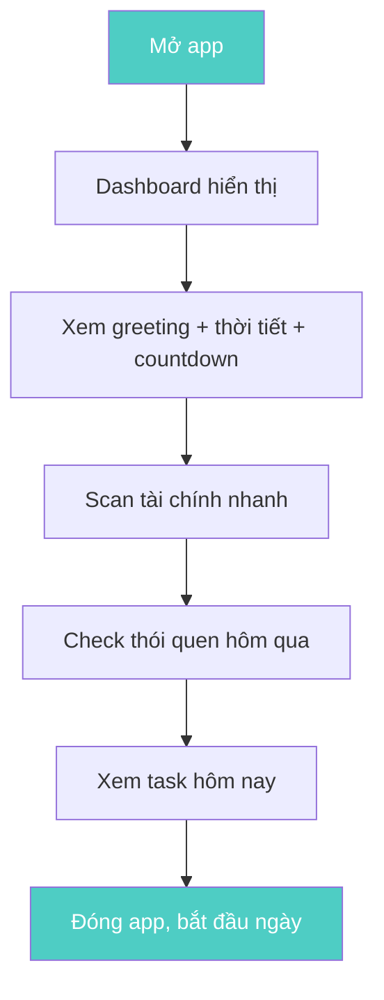
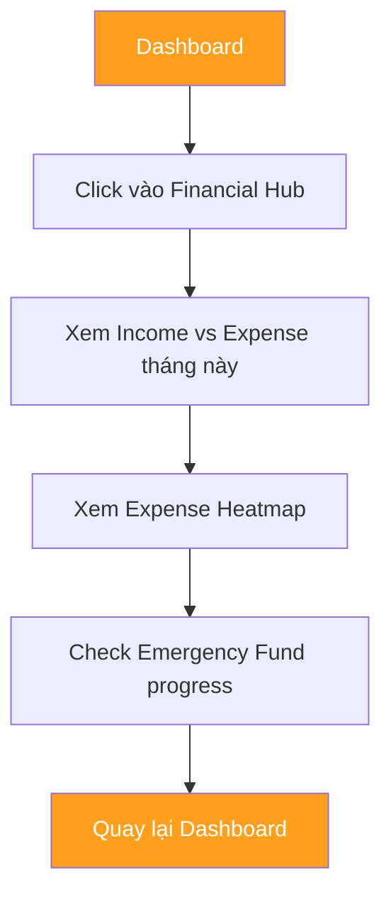
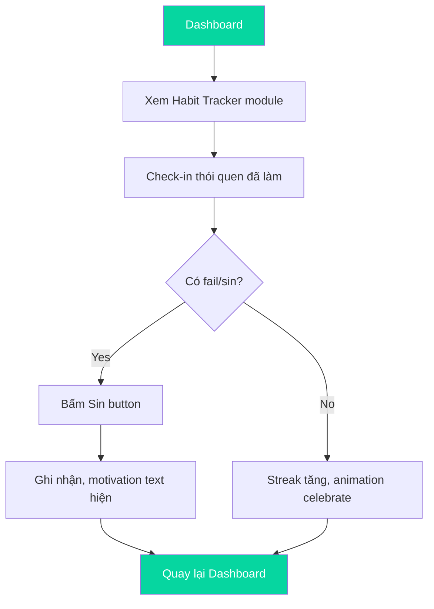
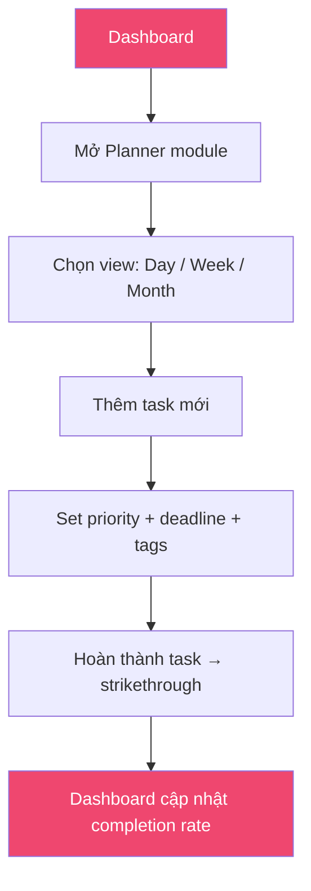
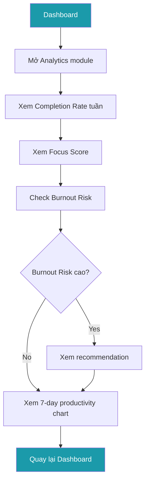

# LifeOS — Product Requirement Document (PRD)

> **Version:** 1.0  
> **Last Updated:** 2026-07-17  
> **Author:** Product Owner  
> **Status:** Draft — Pending Review

---

## 1. Tuyên Ngôn Sản Phẩm (Product Vision)

**LifeOS** là hệ điều hành cá nhân dạng dashboard, giúp người dùng kiểm soát toàn bộ cuộc sống — tài chính, thói quen, công việc, mục tiêu — trong một giao diện duy nhất.

> **One-liner:** "Mỗi sáng, mở LifeOS, biết hôm nay cần làm gì, tài chính ra sao, thói quen thế nào — trong vòng 2 phút."

### Triết lý thiết kế sản phẩm

| Nguyên tắc | Mô tả |
|------------|--------|
| **Data-first** | Thông tin quan trọng nhất hiển thị trước, không ẩn sau nhiều click |
| **Calm but motivating** | Không gây áp lực, nhưng tạo động lực qua visualization |
| **Single source of truth** | Một nơi duy nhất cho tất cả dữ liệu cuộc sống |
| **2-minute rule** | Mọi workflow chính phải hoàn thành trong ≤ 2 phút |

---

## 2. Đối Tượng Người Dùng (Target Users)

### 2.1 Personas

| Persona | Mô tả | Pain Point chính |
|---------|--------|-----------------|
| **🎓 Sinh viên** | Quản lý thời gian học tập, chi tiêu hạn chế, xây dựng thói quen | Dùng 5+ app khác nhau, không có bức tranh toàn cảnh |
| **💻 Software Engineer** | Công việc cường độ cao, cần track focus time, dễ burnout | Quên theo dõi sức khỏe và tài chính vì quá tập trung vào code |
| **🚀 Startup Founder** | Quản lý nhiều dự án, burn rate, personal runway | Không có dashboard cá nhân tương tự như company dashboard |
| **📚 Knowledge Worker** | Freelancer/remote worker, cần kỷ luật tự thân | Thiếu accountability, không ai nhắc nhở ngoài bản thân |

### 2.2 Đặc điểm chung

- Tuổi: 20–40
- Comfort với technology
- Muốn tối ưu hóa cuộc sống nhưng không muốn tốn nhiều thời gian setup
- Đã từng dùng Notion, Todoist, hoặc spreadsheet để tự quản lý
- Thất vọng vì phải switch giữa quá nhiều app

---

## 3. Mục Tiêu Sản Phẩm (Primary Goals)

### 3.1 Goals & KPIs

| # | Goal | KPI | Target |
|---|------|-----|--------|
| G1 | User biết tình hình tài chính ngay khi mở app | Time-to-insight (financial) | ≤ 10 giây |
| G2 | User duy trì thói quen hàng ngày | Habit completion rate | ≥ 70% sau 30 ngày |
| G3 | User hoàn thành task quan trọng mỗi ngày | Daily task completion rate | ≥ 80% |
| G4 | User nhận biết sớm dấu hiệu burnout | Burnout risk detection | Alert khi score > 70% |
| G5 | Toàn bộ morning check-in dưới 2 phút | Session duration | ≤ 120 giây |

### 3.2 Success Metrics (Product-level)

| Metric | Mô tả | Target (MVP) |
|--------|--------|-------------|
| DAU/MAU | Tỷ lệ user active hàng ngày | ≥ 40% |
| Retention D7 | User quay lại sau 7 ngày | ≥ 60% |
| Session Duration | Thời gian trung bình mỗi session | 1.5 – 3 phút |
| NPS | Net Promoter Score | ≥ 50 |

---

## 4. Quy Trình Người Dùng Chính (Primary Workflows)

### 4.1 Morning Check-in (Hàng ngày — Workflow #1)



**Thời gian mục tiêu:** ≤ 2 phút  
**Tần suất:** Hàng ngày, buổi sáng  
**Kết quả:** User biết rõ hôm nay cần focus vào gì

---

### 4.2 Financial Review (Hàng tuần — Workflow #2)



**Thời gian mục tiêu:** ≤ 3 phút  
**Tần suất:** 1-2 lần/tuần  
**Kết quả:** User biết mình đang tiêu bao nhiêu, tiết kiệm bao nhiêu

---

### 4.3 Habit Tracking (Hàng ngày — Workflow #3)



**Thời gian mục tiêu:** ≤ 30 giây  
**Tần suất:** Hàng ngày, buổi tối  
**Kết quả:** User duy trì streak, nhận biết pattern thói quen

---

### 4.4 Task Planning (Hàng ngày — Workflow #4)



**Thời gian mục tiêu:** ≤ 2 phút  
**Tần suất:** Hàng ngày  
**Kết quả:** User có clear list việc cần làm, priority rõ ràng

---

### 4.5 Weekly Analytics Review (Hàng tuần — Workflow #5)



**Thời gian mục tiêu:** ≤ 3 phút  
**Tần suất:** 1 lần/tuần (Chủ nhật tối)  
**Kết quả:** User hiểu productivity trend, điều chỉnh tuần tiếp

---

## 5. Điều Không Làm (Non-Goals)

> [!CAUTION]
> Các tính năng sau **KHÔNG nằm trong scope** của LifeOS. Đây là ranh giới sản phẩm.

| Non-Goal | Lý do |
|----------|-------|
| ❌ Social network / sharing | LifeOS là personal OS, không phải social platform |
| ❌ Accounting software | Không thay thế Misa, QuickBooks — chỉ overview tài chính |
| ❌ Project management (team) | Không phải Jira/Asana — chỉ personal task management |
| ❌ Calendar app | Không thay thế Google Calendar — chỉ hiển thị task timeline |
| ❌ Note-taking app | Không thay thế Notion/Obsidian — chỉ action items |
| ❌ Mobile-native app | MVP là web app, responsive nhưng không phải native |
| ❌ Real-time sync / collaboration | Single user, local-first |
| ❌ AI recommendations | MVP không có AI suggest — chỉ data visualization |

---

## 6. Kiến Trúc Thông Tin (Information Architecture)

### 6.1 Cấu trúc Navigation

```
LifeOS Dashboard
│
├── Topbar (Navigation)
│   ├── Logo + App Name
│   ├── Navigation Links
│   │   ├── Dashboard (Home)
│   │   ├── Financial
│   │   ├── Habits
│   │   ├── Planner
│   │   └── Analytics
│   ├── Theme Switcher
│   └── User Avatar
│
└── Main Content Area (Bento Grid)
    ├── Command Center (hero card, spans full width)
    │   ├── Greeting + Time
    │   ├── Weather
    │   └── Goal Countdown
    │
    ├── Financial Hub (large card)
    │   ├── Income/Expense Summary
    │   ├── Expense Heatmap
    │   └── Emergency Fund Bar
    │
    ├── Habit Tracker (medium card)
    │   ├── Weekly Check Table
    │   ├── Streak Counter
    │   └── Sin/Fail Button
    │
    ├── Time Planner (medium card)
    │   ├── Day/Week/Month Tabs
    │   ├── Task List
    │   └── Add Task
    │
    └── Analytics (large card)
        ├── Completion Rate (circular)
        ├── Focus Score
        ├── Burnout Risk
        └── 7-Day Productivity Bar Chart
```

### 6.2 Layout: Topbar + Bento Grid

```
┌──────────────────────────────────────────────┐
│  Logo    Dashboard  Financial  Habits  ...   │  ← Topbar
├──────────────────────────────────────────────┤
│                                              │
│  ┌──────────────────────────────────────┐    │
│  │         Command Center               │    │  ← Full width
│  └──────────────────────────────────────┘    │
│                                              │
│  ┌─────────────────┐  ┌─────────────────┐   │
│  │                  │  │                  │   │
│  │  Financial Hub   │  │  Habit Tracker   │   │  ← 2 columns
│  │                  │  │                  │   │
│  └─────────────────┘  └─────────────────┘   │
│                                              │
│  ┌─────────────────┐  ┌─────────────────┐   │
│  │                  │  │                  │   │
│  │  Time Planner    │  │  Analytics       │   │  ← 2 columns
│  │                  │  │                  │   │
│  └─────────────────┘  └─────────────────┘   │
│                                              │
└──────────────────────────────────────────────┘
```

### 6.3 Responsive Behavior

| Viewport | Layout |
|----------|--------|
| **Desktop** (≥ 1280px) | Bento Grid 12-col, cards span 6-12 col |
| **Tablet** (768–1279px) | 2-col grid, cards stack partially |
| **Mobile** (< 768px) | 1-col stack, full-width cards |

---

## 7. Tổng Quan Module (Module Overview)

> [!NOTE]
> Đây là mô tả **chức năng** của từng module ở cấp product. Chi tiết kỹ thuật nằm trong COMPONENT_SPEC.md và DATA_SCHEMA.md.

### 7.1 Command Center

| Thuộc tính | Giá trị |
|------------|---------|
| **Mục đích** | Cho user biết "hôm nay là ngày gì" trong 3 giây đầu |
| **Chứa** | Greeting cá nhân hóa, Đồng hồ realtime, Thời tiết, Goal countdown |
| **Vị trí** | Top of Bento Grid, full width |
| **Tương tác** | Passive — chỉ hiển thị, không cần click |
| **Update** | Clock: realtime, Weather: mỗi session, Countdown: realtime |

### 7.2 Financial Hub

| Thuộc tính | Giá trị |
|------------|---------|
| **Mục đích** | Giúp user hiểu sức khỏe tài chính hiện tại |
| **Chứa** | Thu nhập (Income), Chi tiêu (Expense), Số dư (Balance), Tỷ lệ tiết kiệm (Savings Rate), Quỹ khẩn cấp (Emergency Fund), Heatmap chi tiêu (365 ngày) |
| **Tương tác** | Hover heatmap → tooltip chi tiết, Click → expand detail |
| **Empty state** | Card trống với message "Chưa có dữ liệu tài chính" |
| **Error state** | Hiển thị last known data + warning badge |

### 7.3 Habit Tracker

| Thuộc tính | Giá trị |
|------------|---------|
| **Mục đích** | Giúp user duy trì thói quen hàng ngày, track streak |
| **Chứa** | Danh sách thói quen, Weekly check table (7 ngày), Streak counter, Completion rate, Sin/Fail button |
| **Tương tác** | Click check → mark done, Click sin → shake animation + log, Hover → show streak detail |
| **Gamification** | Streak counter tăng → celebrate animation, Streak break → gentle reminder |
| **Empty state** | Illustration + "Thêm thói quen đầu tiên" |

### 7.4 Time Planner

| Thuộc tính | Giá trị |
|------------|---------|
| **Mục đích** | Quản lý task cá nhân với priority và deadline |
| **Chứa** | View tabs (Day / Week / Month), Task list (sortable by priority), Add task form, Priority levels (High / Medium / Low), Tags, Deadline |
| **Tương tác** | Complete task → strikethrough animation, Add task → slide-in form, Switch tab → content transition, Drag to reorder (future) |
| **Empty state** | Illustration + "Không có task nào — ngày rảnh!" |

### 7.5 Reality Check Analytics

| Thuộc tính | Giá trị |
|------------|---------|
| **Mục đích** | Cho user thấy bức tranh productivity tổng quan |
| **Chứa** | Completion Rate (circular progress), Focus Score (0–100), Burnout Risk (0–100 với color coding), 7-Day Productivity bar chart, Weekly/Monthly trend |
| **Tương tác** | Hover chart → tooltip, Click metric → expand detail |
| **Alert logic** | Burnout Risk > 70% → Warning visual + recommendation text |
| **Empty state** | Zero-state cards với "Cần ít nhất 3 ngày dữ liệu" |

---

## 8. Metrics & Measurement

### 8.1 Cách đo thành công của từng module

| Module | Metric | Đo bằng |
|--------|--------|---------|
| Command Center | Glance time | User nhìn < 3s rồi scroll xuống = thành công |
| Financial Hub | Engagement rate | % user interact với heatmap/expand |
| Habit Tracker | Streak length | Trung bình streak dài bao nhiêu ngày |
| Planner | Task completion | % task complete vs created |
| Analytics | Session trigger | Bao nhiêu % user mở analytics mỗi tuần |

---

## Phụ Lục

### A. Competitive Analysis

| App | Strengths | LifeOS differentiator |
|-----|-----------|----------------------|
| Notion | Flexible, customizable | LifeOS: Zero setup, opinionated dashboard |
| Todoist | Great task management | LifeOS: Combines tasks + finance + habits |
| Mint/Misa | Financial tracking | LifeOS: Overview only, not accounting |
| Habitica | Habit gamification | LifeOS: Serious, data-driven, not game-like |
| Apple Health | Health dashboard | LifeOS: Life dashboard, not health-only |

### B. Release Phases

| Phase | Scope | Timeline |
|-------|-------|----------|
| **MVP** | Dashboard + 5 modules, mockData, theme switching | Current |
| **V1.1** | LocalStorage persistence, data import/export | Post-MVP |
| **V1.2** | API integration, real data sources | Future |
| **V2.0** | Mobile PWA, notifications, AI insights | Long-term |
