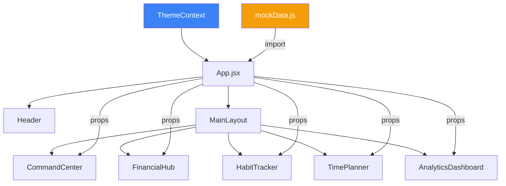
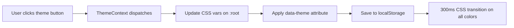

# LifeOS — Technical Specification

> **Version:** 1.0  
> **Last Updated:** 2026-07-17  
> **Author:** Lead Engineer  
> **Status:** Draft — Pending Review  
> **Depends on:** All previous spec documents

---

## 1. Tech Stack

| Layer | Technology | Version | Purpose |
|-------|-----------|---------|---------|
| **Runtime** | React | 18+ | UI library |
| **Bundler** | Vite | Latest | Dev server + build |
| **Styling** | Tailwind CSS | 3.x | Utility-first CSS |
| **Icons** | lucide-react | Latest | Icon library |
| **Animation** | Anime.js | 3.x | Complex animations (transforms, SVG, numbers) |
| **Language** | JavaScript (ES2022+) | — | Application logic |
| **Package Manager** | npm | — | Dependency management |

### 1.1 Why These Choices

| Decision | Rationale |
|----------|-----------|
| React 18 | Concurrent features, wide ecosystem, team familiarity |
| Vite | Fast HMR, ESM-native, minimal config |
| Tailwind | Rapid UI development, design token mapping, consistent spacing |
| Anime.js | Lightweight (16KB), timeline support, spring physics, SVG morphing |
| No TypeScript (MVP) | Faster iteration. TypeScript migration planned for V1.1 |
| No state management lib | Context API sufficient for single-user dashboard |

### 1.2 What NOT to Use

| Technology | Reason |
|-----------|--------|
| Redux / Zustand | Overkill for MVP scope |
| Framer Motion | Conflicts with Anime.js, larger bundle |
| Chart.js / D3 | Custom SVG + Anime.js is lighter and more controlled |
| CSS Modules / Styled Components | Tailwind handles all styling needs |
| Next.js | SSR unnecessary for single-page dashboard |

---

## 2. Folder Structure

```
src/
├── main.jsx                         # App entry point
├── App.jsx                          # Root component, providers
├── index.css                        # Tailwind directives + CSS custom properties
│
├── components/
│   ├── common/
│   │   ├── Card.jsx
│   │   ├── MetricCard.jsx
│   │   ├── ProgressBar.jsx
│   │   ├── AnimatedCounter.jsx
│   │   ├── SectionTitle.jsx
│   │   ├── IconButton.jsx
│   │   ├── Badge.jsx
│   │   ├── Skeleton.jsx
│   │   ├── EmptyState.jsx
│   │   └── ErrorState.jsx
│   │
│   ├── dashboard/
│   │   ├── CommandCenter.jsx
│   │   ├── FinancialHub.jsx
│   │   ├── HabitTracker.jsx
│   │   ├── TimePlanner.jsx
│   │   └── AnalyticsDashboard.jsx
│   │
│   └── layout/
│       ├── Header.jsx
│       └── MainLayout.jsx
│
├── contexts/
│   └── ThemeContext.jsx             # Theme state + provider
│
├── hooks/
│   ├── useAnimeTimeline.js          # Reusable Anime.js timeline hook
│   ├── useCountAnimation.js         # Number count-up hook
│   ├── useStagger.js                # Staggered entrance hook
│   ├── useTheme.js                  # Theme consumer hook
│   ├── useIntersectionObserver.js   # Scroll-triggered animations
│   └── useReducedMotion.js          # prefers-reduced-motion detection
│
└── utils/
    ├── mockData.js                  # All mock data (see DATA_SCHEMA.md)
    ├── animeHelpers.js              # Animation presets and utilities
    ├── formatters.js                # Number/date/currency formatting
    └── constants.js                 # Theme palettes, breakpoints, etc.
```

### 2.1 File Naming Conventions

| Type | Convention | Example |
|------|-----------|---------|
| Components | PascalCase | `MetricCard.jsx` |
| Hooks | camelCase with `use` prefix | `useTheme.js` |
| Utils | camelCase | `formatters.js` |
| Constants | camelCase | `constants.js` |
| CSS | kebab-case | `index.css` |

---

## 3. State Management

### 3.1 Architecture



### 3.2 Data Flow

| Layer | Responsibility |
|-------|---------------|
| `mockData.js` | Static data source (MVP) |
| `App.jsx` | Imports data, manages app-level state (tasks, habits), passes as props |
| `ThemeContext` | Theme palette + mode, persisted to localStorage |
| Module components | Receive data via props, manage local UI state (tabs, forms, etc.) |

### 3.3 State Locations

| State | Owner | Storage |
|-------|-------|---------|
| Theme (palette + mode) | ThemeContext | localStorage |
| Current time | CommandCenter (local) | useState + setInterval |
| Active nav section | App.jsx | useState |
| Tasks list | App.jsx | useState (initialized from mockData) |
| Habits list | App.jsx | useState (initialized from mockData) |
| Planner view (day/week/month) | TimePlanner (local) | useState |
| Mobile menu open | Header (local) | useState |
| Add task form visible | TimePlanner (local) | useState |

---

## 4. Theme System

### 4.1 CSS Custom Properties

All design tokens from DESIGN_SYSTEM.md are implemented as CSS custom properties on `:root`.

```css
:root {
  /* Palette — overridden by ThemeContext */
  --color-palette-1: #22577a;
  --color-palette-2: #38a3a5;
  --color-palette-3: #57cc99;
  --color-palette-4: #80ed99;
  --color-palette-5: #c7f9cc;
  
  /* Semantic */
  --color-bg: #ffffff;
  --color-surface: #ffffff;
  --color-text-primary: #111827;
  --color-text-secondary: #6b7280;
  --color-border: #e5e7eb;
  
  /* ... all tokens from DESIGN_SYSTEM.md */
}

[data-theme="dark"] {
  --color-bg: #0a0a0a;
  --color-surface: #141414;
  --color-text-primary: #f9fafb;
  --color-text-secondary: #9ca3af;
  --color-border: #1f2937;
}
```

### 4.2 Tailwind Configuration

Extend Tailwind config to use CSS custom properties:

```javascript
// tailwind.config.js
module.exports = {
  theme: {
    extend: {
      colors: {
        palette: {
          1: 'var(--color-palette-1)',
          2: 'var(--color-palette-2)',
          3: 'var(--color-palette-3)',
          4: 'var(--color-palette-4)',
          5: 'var(--color-palette-5)',
        },
        surface: 'var(--color-surface)',
        'surface-hover': 'var(--color-surface-hover)',
        border: 'var(--color-border)',
      },
      borderRadius: {
        'card': '16px',
        'card-lg': '20px',
      },
      // ... extend with all DESIGN_SYSTEM tokens
    }
  }
}
```

### 4.3 Theme Switch Implementation



---

## 5. Anime.js Integration Rules

### 5.1 Core Rules

| Rule | Description |
|------|-------------|
| **useRef always** | All animated DOM elements MUST use `useRef`. Never query DOM directly |
| **Cleanup always** | Call `anime.remove(ref.current)` before new animations AND in `useEffect` cleanup |
| **A11y check** | Detect `prefers-reduced-motion` via `useReducedMotion()` hook. Disable/shorten if true |
| **CSS boundary** | CSS handles: hover color/bg changes. Anime.js handles: transforms, scale, SVG, numbers |

### 5.2 Animation Helper Structure

```javascript
// animeHelpers.js
export const presets = {
  fadeInUp: (target, delay = 0) => ({
    targets: target,
    opacity: [0, 1],
    translateY: [10, 0],
    duration: 300,
    easing: 'easeOutExpo',
    delay,
  }),
  
  staggerFadeInUp: (target) => ({
    targets: target,
    opacity: [0, 1],
    translateY: [10, 0],
    duration: 300,
    easing: 'easeOutExpo',
    delay: anime.stagger(50),
  }),
  
  barGrowth: (target) => ({
    targets: target,
    scaleY: [0, 1],
    duration: 600,
    easing: 'spring(1, 80, 10, 0)',
    delay: anime.stagger(50),
  }),
  
  countUp: (target, value) => ({
    targets: target,
    innerHTML: [0, value],
    round: 1,
    duration: 800,
    easing: 'easeOutExpo',
  }),
  
  shake: (target) => ({
    targets: target,
    translateX: [0, -10, 10, -5, 5, 0],
    duration: 400,
    easing: 'easeOutExpo',
  }),
};
```

### 5.3 Custom Hooks

#### useAnimeTimeline

```javascript
// Purpose: Create and manage an Anime.js timeline with automatic cleanup
// Input: timeline configuration
// Output: { timeline, play, pause, restart }
// Cleanup: Removes all animations on unmount
```

#### useCountAnimation

```javascript
// Purpose: Animate a number from 0 to target value
// Input: targetValue, duration, options
// Output: ref to attach to DOM element
// Reduced motion: Shows final value immediately
```

#### useStagger

```javascript
// Purpose: Staggered entrance animation for list/grid children
// Input: containerRef, options (delay, animation type)
// Output: play() function
// Cleanup: Removes animations on unmount
```

#### useReducedMotion

```javascript
// Purpose: Detect prefers-reduced-motion media query
// Output: boolean (true = reduced motion preferred)
// Updates: Listens for media query changes
```

#### useIntersectionObserver

```javascript
// Purpose: Trigger animations when elements scroll into view
// Input: ref, options (threshold, rootMargin)
// Output: isVisible boolean
// Behavior: Triggers once, then disconnects
```

---

## 6. Performance Requirements

### 6.1 Non-Functional Requirements

| Requirement | Target | How to Achieve |
|-------------|--------|---------------|
| **Animation FPS** | 60fps | GPU-only properties (transform, opacity) |
| **No layout shift** | CLS = 0 | Fixed dimensions, skeleton placeholders match content |
| **No hydration mismatch** | N/A | No SSR in MVP (Vite CSR only) |
| **First Contentful Paint** | < 1.5s | Minimal bundle, no heavy deps |
| **Time to Interactive** | < 2.5s | Lazy render below-fold modules |
| **Bundle size** | < 200KB gzipped | Tree-shake, no heavy chart libs |

### 6.2 Rendering Optimization

| Strategy | Where |
|----------|-------|
| `React.memo` | All common components (Card, MetricCard, etc.) |
| `useMemo` | Expensive computations (analytics calculations, heatmap levels) |
| `useCallback` | Event handlers passed as props |
| Lazy rendering | Modules below viewport: render on scroll (IntersectionObserver) |
| Skeleton first | Show skeletons immediately, swap to content when ready |

### 6.3 Animation Performance

| Rule | Implementation |
|------|---------------|
| Only animate `transform` + `opacity` | Never animate width, height, top, left, margin |
| `will-change` | Set before animation, remove after |
| Max 20 concurrent animations | Queue excess animations |
| Stagger cap | 500ms for lists, 2000ms for heatmap |
| Cleanup on unmount | `anime.remove()` in useEffect cleanup |

---

## 7. Responsive Implementation

### 7.1 Breakpoint Strategy (Desktop-First)

```css
/* Desktop (default) */
.grid { grid-template-columns: repeat(12, 1fr); gap: 24px; }

/* Tablet */
@media (max-width: 1279px) {
  .grid { grid-template-columns: repeat(2, 1fr); gap: 16px; }
}

/* Mobile */
@media (max-width: 767px) {
  .grid { grid-template-columns: 1fr; gap: 12px; }
}
```

### 7.2 Component-Level Responsive

| Component | Desktop | Mobile Change |
|-----------|---------|--------------|
| Header | Horizontal nav links | Hamburger → overlay |
| Bento Grid | 12-col | 1-col stack |
| Card padding | 24px | 16px |
| Typography | Full scale | Reduced (body 14→13px) |
| Heatmap | Full grid | Horizontal scroll |
| Habit table | 7 columns | Horizontal scroll |

---

## 8. Browser Support

| Browser | Version |
|---------|---------|
| Chrome | Last 2 versions |
| Firefox | Last 2 versions |
| Safari | Last 2 versions |
| Edge | Last 2 versions |
| Mobile Safari | iOS 15+ |
| Chrome Android | Last 2 versions |

---

## 9. Accessibility Implementation

### 9.1 ARIA Patterns

| Component | ARIA |
|-----------|------|
| Card | `role="region"`, `aria-label={title}` |
| ProgressBar | `role="progressbar"`, `aria-valuenow`, `aria-valuemin`, `aria-valuemax` |
| Tabs (Planner) | `role="tablist"`, `role="tab"`, `role="tabpanel"`, `aria-selected` |
| AnimatedCounter | `aria-live="polite"` |
| Loading states | `aria-busy="true"` |
| Icon buttons | `aria-label={label}` |
| Nav | `role="navigation"`, `aria-label="Main navigation"` |
| Mobile menu | `role="dialog"`, `aria-modal="true"`, focus trap |

### 9.2 Keyboard Navigation

| Key | Global Behavior |
|-----|----------------|
| Tab | Move between interactive elements |
| Enter/Space | Activate focused element |
| Escape | Close overlay/modal/form |
| Arrow keys | Navigate within tab groups |

### 9.3 Focus Management

- Visible focus ring: 2px outline using `--color-palette-1`, offset 2px
- Focus trap in mobile menu overlay
- Return focus to trigger element when modal/overlay closes

---

## 10. Error Handling Strategy

### 10.1 Component-Level

```javascript
// Pattern for each dashboard module
function FinancialHub({ data, loading }) {
  if (loading) return <FinancialHubSkeleton />;
  if (!data) return <ErrorState message="Failed to load" onRetry={...} />;
  if (data.transactions.length === 0) return <EmptyState message="No data yet" />;
  return <FinancialHubContent data={data} />;
}
```

### 10.2 Error Boundary

Wrap each dashboard module in an Error Boundary. If one module crashes, others continue working.

```
App
├── ErrorBoundary → CommandCenter
├── ErrorBoundary → FinancialHub
├── ErrorBoundary → HabitTracker
├── ErrorBoundary → TimePlanner
└── ErrorBoundary → AnalyticsDashboard
```

---

## 11. Development Workflow

### 11.1 Dev Server

```bash
npm run dev          # Start Vite dev server (port 5173)
npm run build        # Production build
npm run preview      # Preview production build
```

### 11.2 Code Quality (Future)

| Tool | Purpose | When |
|------|---------|------|
| ESLint | Linting | V1.1 |
| Prettier | Formatting | V1.1 |
| TypeScript | Type safety | V1.1 |
| Vitest | Unit tests | V1.1 |
| Playwright | E2E tests | V1.2 |
