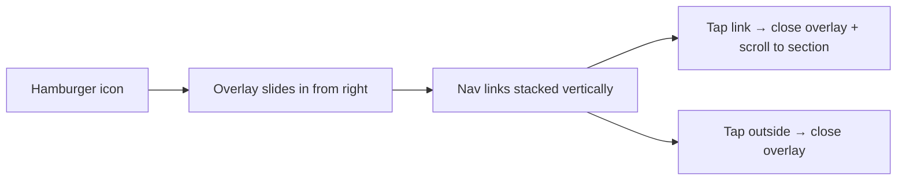
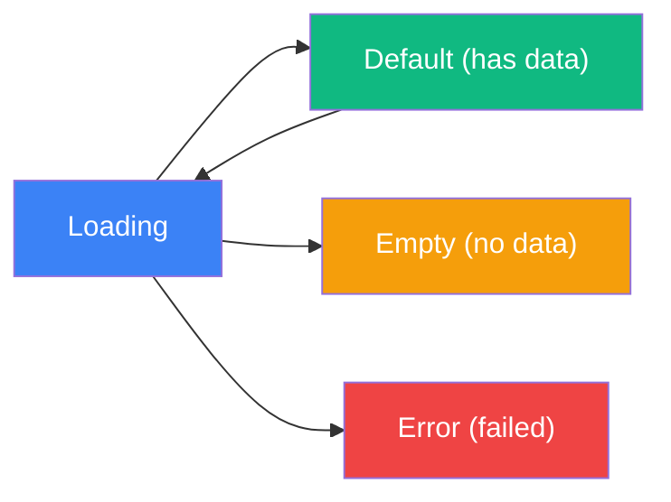

# LifeOS — User Experience Specification (UX_SPEC)

> **Version:** 1.0  
> **Last Updated:** 2026-07-17  
> **Author:** UX Director  
> **Status:** Draft — Pending Review  
> **Depends on:** PRD.md

---

## 1. Design Philosophy

| Principle | Description | Do | Don't |
|-----------|-------------|-----|-------|
| **Minimal** | Loại bỏ mọi thứ không cần thiết | Clean surfaces, whitespace | Clutter, decorative elements |
| **Premium** | Cảm giác cao cấp, polished | Subtle shadows, crisp typography | Cheap gradients, stock art |
| **Data-first** | Data là hero, UI là nền | Large metrics, clear hierarchy | Hidden data, too many clicks |
| **Calm but motivating** | Không gây stress, nhưng tạo momentum | Soft colors, smooth transitions | Aggressive alerts, red everywhere |

### Design Inspiration

| Reference | Lấy gì |
|-----------|--------|
| **Linear** | Clean layout, monochrome + accent, typography hierarchy |
| **Notion** | Card-based layout, breathable spacing |
| **Raycast** | Command palette feel, snappy interactions |
| **Vercel Dashboard** | Data visualization, dark mode excellence |
| **Apple Fitness** | Ring/circular progress, motivational UI, activity cards |

---

## 2. Layout Architecture

### 2.1 Layout Model: Topbar + Bento Grid

```
┌─────────────────────────────────────────────────────────┐
│  [Logo]   Dashboard   Financial   Habits   Planner   Analytics   [Theme] [Avatar]  │
├─────────────────────────────────────────────────────────┤
│                                                         │
│  ┌─────────────────────────────────────────────────┐    │
│  │              Command Center (12 col)             │    │
│  └─────────────────────────────────────────────────┘    │
│                                                         │
│  ┌────────────────────┐    ┌────────────────────┐       │
│  │   Financial Hub     │    │   Habit Tracker     │       │
│  │   (6 col)           │    │   (6 col)           │       │
│  │                     │    │                     │       │
│  └────────────────────┘    └────────────────────┘       │
│                                                         │
│  ┌────────────────────┐    ┌────────────────────┐       │
│  │   Time Planner      │    │   Analytics         │       │
│  │   (6 col)           │    │   (6 col)           │       │
│  │                     │    │                     │       │
│  └────────────────────┘    └────────────────────┘       │
│                                                         │
└─────────────────────────────────────────────────────────┘
```

### 2.2 Grid System

| Property | Value |
|----------|-------|
| Type | CSS Grid, 12 columns |
| Gap | 24px (desktop), 16px (tablet), 12px (mobile) |
| Container max-width | 1440px |
| Container padding | 32px (desktop), 24px (tablet), 16px (mobile) |

### 2.3 Card Span Rules

| Card | Desktop (12-col) | Tablet (6-col) | Mobile (1-col) |
|------|-------------------|-----------------|-----------------|
| Command Center | 12 | 6 | 1 |
| Financial Hub | 6 | 6 | 1 |
| Habit Tracker | 6 | 6 | 1 |
| Time Planner | 6 | 6 | 1 |
| Analytics | 6 | 6 | 1 |

---

## 3. Topbar Specification

### 3.1 Anatomy

```
┌─────────────────────────────────────────────────────────┐
│  [Logo]  │  Nav Links (active has underline)  │  [Actions]│
└─────────────────────────────────────────────────────────┘
```

| Element | Behavior |
|---------|----------|
| **Logo** | Click → scroll to top / reload dashboard |
| **Nav Links** | Dashboard, Financial, Habits, Planner, Analytics |
| **Active indicator** | Bottom border (2px accent color) hoặc background highlight |
| **Theme Switcher** | Icon button, cycles through palettes |
| **User Avatar** | Static display (MVP), dropdown menu (future) |

### 3.2 Topbar States

| State | Behavior |
|-------|----------|
| **Default** | Visible, static |
| **Scroll** | Sticky (position: sticky, top: 0), slight shadow on scroll |
| **Mobile** | Hamburger menu → slide-in overlay |

### 3.3 Mobile Navigation



---

## 4. Surface & Card Rules

### 4.1 Surface Style

| Property | Value |
|----------|-------|
| Background | Flat solid color (NO glassmorphism, NO blur) |
| Border | 1px solid, subtle (gray-200 light / gray-800 dark) |
| Border Radius | 16px (default cards), 20px (hero/large cards) |
| Shadow | None by default, subtle on hover |

### 4.2 Card Anatomy

Mọi card **BẮT BUỘC** phải có cấu trúc sau:

```
┌─────────────────────────────────────┐
│  [Icon]  Title                      │  ← Header (required)
│          Subtitle / Context         │  ← Subtitle (optional)
├─────────────────────────────────────┤
│                                     │
│  ██████  Primary Metric             │  ← Hero content (required)
│  ████    (large typography)         │
│                                     │
│  Secondary info / chart / list      │  ← Body (required)
│                                     │
├─────────────────────────────────────┤
│  Footer action / link / timestamp   │  ← Footer (optional)
└─────────────────────────────────────┘
```

### 4.3 Card Spacing

| Area | Padding |
|------|---------|
| Card outer padding | 24px (desktop), 20px (tablet), 16px (mobile) |
| Header to body | 16px |
| Body to footer | 16px |
| Between metric items | 12px |

---

## 5. Typography Rules

### 5.1 Font Family

| Priority | Font |
|----------|------|
| Primary | Inter |
| Fallback | System sans-serif stack: `-apple-system, BlinkMacSystemFont, 'Segoe UI', sans-serif` |

### 5.2 Type Scale

| Token | Size | Weight | Usage |
|-------|------|--------|-------|
| `display` | 48px | 700 | Hero numbers (financial totals) |
| `heading-1` | 32px | 700 | Page titles |
| `heading-2` | 24px | 600 | Section titles, card titles |
| `heading-3` | 20px | 600 | Sub-section titles |
| `body-large` | 16px | 400 | Primary body text |
| `body` | 14px | 400 | Secondary text, descriptions |
| `caption` | 12px | 500 | Labels, timestamps, badges |

### 5.3 Typography Rules

| Rule | Value |
|------|-------|
| Line height | 1.5 (body), 1.2 (headings), 1.0 (display numbers) |
| Letter spacing | -0.02em (headings), 0 (body), 0.02em (caption/labels) |
| Max line width | 65ch (prose), unlimited (data) |
| Number style | Tabular nums for financial data, proportional for body |

---

## 6. Color Philosophy

### 6.1 Theme System

LifeOS hỗ trợ **nhiều color palettes**, user có thể switch bất kỳ lúc nào.

| Theme | Palette (5 colors: primary → lightest) |
|-------|---------------------------------------|
| **Deep Sea Mint** | `#22577a`, `#38a3a5`, `#57cc99`, `#80ed99`, `#c7f9cc` |
| **Icy Navy** | `#1b4965`, `#62b6cb`, `#5fa8d3`, `#cae9ff`, `#bee9e8` |
| **Vibrant Pop** | `#1b9aaa`, `#ef476f`, `#ffc43d`, `#06d6a0`, `#f8ffe5` |
| **Citrus Sunrise** | `#ff9f1c`, `#ffbf69`, `#2ec4b6`, `#cbf3f0`, `#ffffff` |

### 6.2 Semantic Color Mapping

| Semantic Token | Maps to |
|---------------|---------|
| `--color-primary` | Palette[0] — Darkest, accent, CTAs |
| `--color-secondary` | Palette[1] — Supporting elements |
| `--color-accent` | Palette[2] — Charts, highlights |
| `--color-surface-accent` | Palette[3] — Light backgrounds, hover states |
| `--color-surface-light` | Palette[4] — Lightest backgrounds |

### 6.3 Dark Mode

| Property | Light Mode | Dark Mode |
|----------|-----------|-----------|
| Background | `#ffffff` | `#0a0a0a` |
| Surface (cards) | `#ffffff` | `#141414` |
| Border | `#e5e7eb` (gray-200) | `#1f2937` (gray-800) |
| Text primary | `#111827` (gray-900) | `#f9fafb` (gray-50) |
| Text secondary | `#6b7280` (gray-500) | `#9ca3af` (gray-400) |

### 6.4 Status Colors

| Status | Color | Usage |
|--------|-------|-------|
| Success | `#10b981` | Completed tasks, positive trends |
| Warning | `#f59e0b` | Burnout risk medium, approaching deadline |
| Danger | `#ef4444` | Burnout risk high, overdue, budget exceeded |
| Info | `#3b82f6` | Neutral information, tooltips |

---

## 7. Interaction Patterns

### 7.1 Hover States

| Element | Hover Effect |
|---------|-------------|
| Card | Subtle shadow increase + slight translateY (-2px) |
| Button (primary) | Darken background 10% |
| Button (secondary) | Show background tint |
| Nav link | Show underline / background highlight |
| Heatmap cell | Show tooltip with value |
| Task item | Show action buttons (complete, edit, delete) |
| Chart bar | Highlight + tooltip with value |

### 7.2 Click/Tap Patterns

| Element | Click Effect |
|---------|-------------|
| Habit checkbox | Toggle check → animate check mark |
| Sin button | Trigger shake animation → log entry |
| Task complete | Strikethrough animation → move to completed |
| Tab switch | Content crossfade transition |
| Theme switch | Smooth color transition (all CSS variables) |
| Add task | Slide-in form from bottom of card |

### 7.3 Focus & Keyboard Navigation

| Key | Action |
|-----|--------|
| `Tab` | Move between interactive elements |
| `Enter` / `Space` | Activate focused element |
| `Escape` | Close modal / overlay / form |
| `Arrow keys` | Navigate within tab groups, lists |

Focus indicator: `2px outline` using `--color-primary`, offset `2px`.

---

## 8. State Definitions

> [!IMPORTANT]
> Mọi component hiển thị dữ liệu **BẮT BUỘC** phải handle tất cả 4 states dưới đây.

### 8.1 The Four States



### 8.2 Loading State

| Property | Behavior |
|----------|----------|
| Visual | Skeleton placeholder (pulse animation) |
| Duration | Show skeleton for min 300ms (avoid flash) |
| Layout | Skeleton phải match layout của content (same dimensions) |

### 8.3 Empty State

| Module | Empty Message | Visual |
|--------|--------------|--------|
| Financial Hub | "Chưa có dữ liệu tài chính" | Empty card + illustration |
| Habit Tracker | "Thêm thói quen đầu tiên" | Illustration + CTA button |
| Time Planner | "Không có task nào — ngày rảnh!" | Illustration + add button |
| Analytics | "Cần ít nhất 3 ngày dữ liệu" | Progress indicator |

### 8.4 Error State

| Module | Error Behavior |
|--------|---------------|
| Command Center (weather) | Show mock weather data + subtle "offline" badge |
| Financial Hub | Show last known data + warning badge + retry button |
| Habit Tracker | Show cached data + sync indicator |
| Planner | Show cached tasks + warning |
| Analytics | Show partial data + "Dữ liệu chưa đầy đủ" message |

### 8.5 Disabled State

| Property | Value |
|----------|-------|
| Opacity | 0.5 |
| Cursor | `not-allowed` |
| Interaction | None (no hover, no click) |

---

## 9. Responsive Strategy

### 9.1 Approach: Desktop-First

Design cho Desktop (1440px) trước, scale down cho Tablet và Mobile.

### 9.2 Breakpoints

| Name | Range | Layout Changes |
|------|-------|---------------|
| **Desktop** | ≥ 1280px | Full Bento Grid (12-col), Topbar horizontal |
| **Tablet** | 768px – 1279px | 2-col grid, cards smaller padding, Topbar compact |
| **Mobile** | < 768px | 1-col stack, hamburger nav, full-width cards |

### 9.3 Component Behavior per Breakpoint

| Component | Desktop | Tablet | Mobile |
|-----------|---------|--------|--------|
| Topbar | Horizontal nav, all links visible | Compact, truncated labels | Hamburger + overlay |
| Command Center | Full width, horizontal layout | Full width, slightly shorter | Full width, stacked vertical |
| Financial Hub | 6-col, heatmap full | 6-col, heatmap condensed | Full width, heatmap scrollable |
| Habit Tracker | 6-col, 7-day table visible | 6-col, table compact | Full width, horizontally scrollable |
| Planner | 6-col, tabs + list | 6-col, compact list | Full width, tabs scrollable |
| Analytics | 6-col, charts visible | 6-col, charts resized | Full width, charts stacked |
| Card padding | 24px | 20px | 16px |
| Grid gap | 24px | 16px | 12px |
| Typography | Full scale | Slightly reduced | Reduced (body: 14px → 13px) |

---

## 10. Accessibility Requirements

### 10.1 Standards

| Standard | Target |
|----------|--------|
| WCAG Level | AA (minimum) |
| Contrast ratio (text) | ≥ 4.5:1 (normal), ≥ 3:1 (large) |
| Contrast ratio (UI) | ≥ 3:1 |
| Touch target size | ≥ 44px × 44px |

### 10.2 Screen Reader

| Element | Requirement |
|---------|-------------|
| Charts | `aria-label` mô tả data (e.g., "Completion rate: 73%") |
| Icons | Decorative: `aria-hidden="true"`, Functional: `aria-label` |
| Dynamic content | `aria-live="polite"` cho animated counters |
| Status changes | Announce via `role="status"` |

### 10.3 Reduced Motion

| Condition | Behavior |
|-----------|----------|
| `prefers-reduced-motion: reduce` | Tắt toàn bộ transform animations |
| Fallback | Chỉ dùng opacity transitions (instant feel) |
| Number counters | Show final value immediately, no counting |
| Chart animations | Show final state immediately |

### 10.4 Color Blindness

| Requirement | Solution |
|-------------|----------|
| Không dựa hoàn toàn vào color để truyền thông tin | Kết hợp icon, pattern, label |
| Heatmap | Kèm tooltip với giá trị số |
| Status indicators | Icon + color (✓ green, ⚠ yellow, ✕ red) |

---

## 11. Scroll & Overflow Behavior

| Scenario | Behavior |
|----------|----------|
| Page scroll | Smooth scroll, Topbar sticky |
| Card content overflow | Scroll within card (max-height) hoặc "Show more" |
| Heatmap overflow (mobile) | Horizontal scroll within container |
| Task list overflow | Scroll within Planner card |
| Table overflow (mobile) | Horizontal scroll with fade indicator |

---

## 12. Transition & Page Navigation

### 12.1 Navigation Model

MVP sử dụng **single-page scroll** — tất cả modules trên 1 trang, nav links scroll tới section tương ứng.

| Action | Behavior |
|--------|----------|
| Click nav link | Smooth scroll to target section |
| Active section detection | Highlight nav link khi section đó visible in viewport |
| URL update | Optional: `#financial`, `#habits`, etc. cho deep linking |

### 12.2 Future: Multi-page

Post-MVP có thể tách thành multi-page routing (Financial page riêng, Habits page riêng) — nhưng MVP giữ single-page dashboard.
